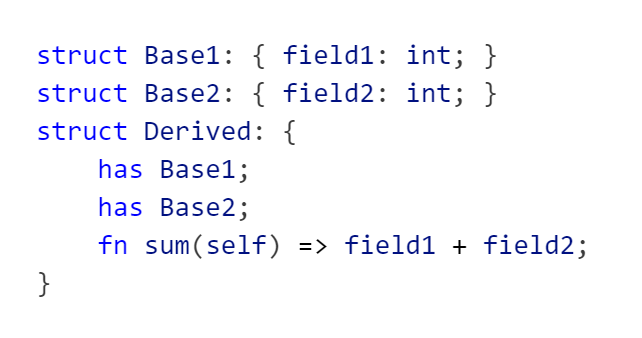
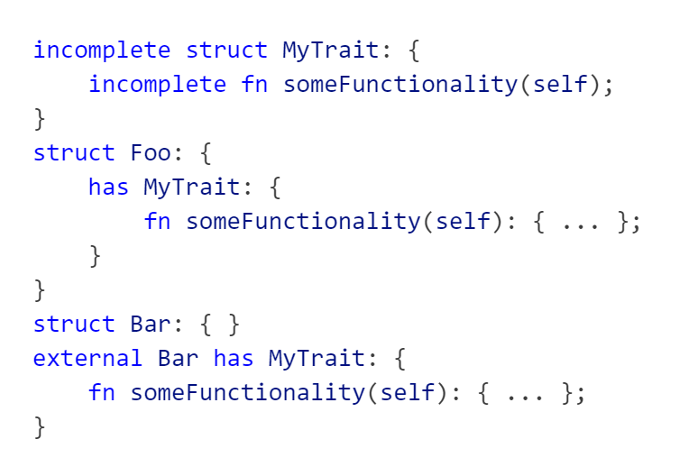
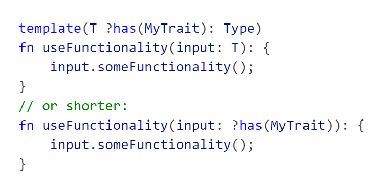

# Charge Language

## Inheritance / Traits
Many models of inheritance exist in different programming languages. Charge incorporates aspects of [C++ Classes](https://en.cppreference.com/w/cpp/language/derived_class), [LLVM-style RTTI](https://llvm.org/docs/HowToSetUpLLVMStyleRTTI.html), [Rust Traits](https://doc.rust-lang.org/book/ch10-02-traits.html) and [Rust Enums](https://doc.rust-lang.org/book/ch06-01-defining-an-enum.html) into its inheritance system.

Here is a basic example illustrating the syntax and usage:

### Traits
Traits are a powerful tool for writing generic code. The core idea is to define interface or trait that describes some common functionality shared by different types. Generic code can then use the interface to handle all types that implement it at once. In Charge interfaces are defined using `incomplete` types, which cannot be instantiated themselves and are allowed to have functions without a definition. The complete type that derives from the trait then has to implement these functions.

To get the full flexibility it must be possible to define common functionality among types not controlled by the trait author. Thus, a Trait may be implemented outside the type definition as long as it is empty, that is it has no fields.

Here is an example how to write generic code, for more details see [Template System](#Template-System):

### Classes

## Value semantics

## Matching / Destructuring

## No forward declarations

## Template system

## Types are expressions

## No `null`-pointers