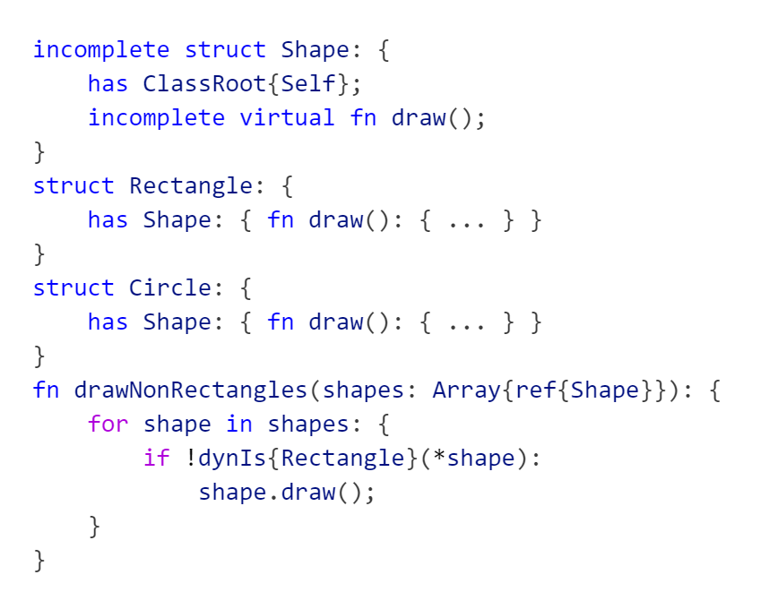
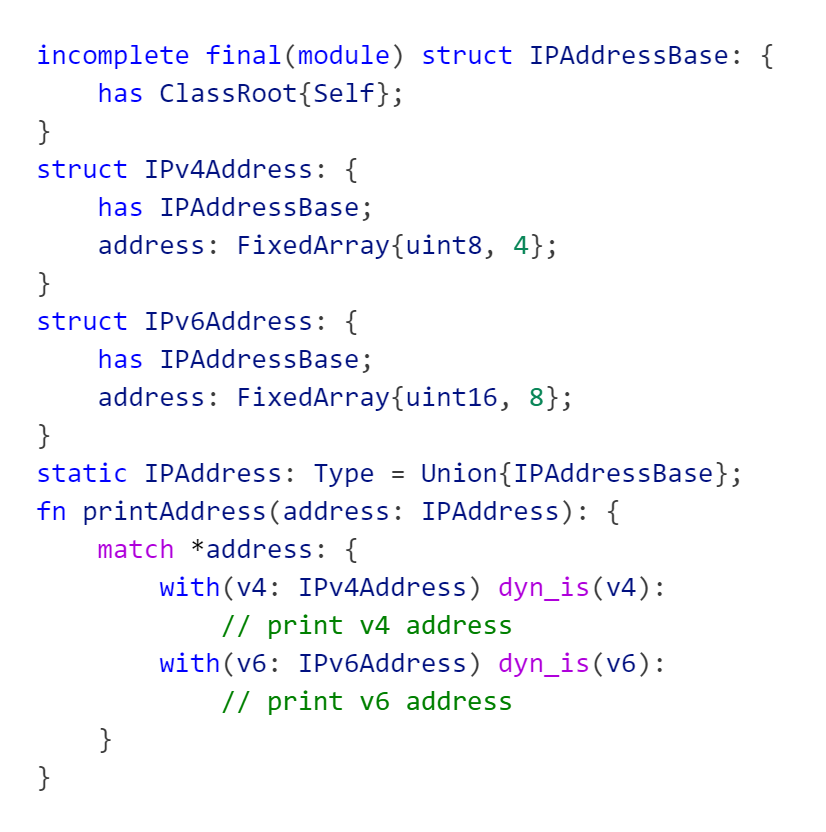
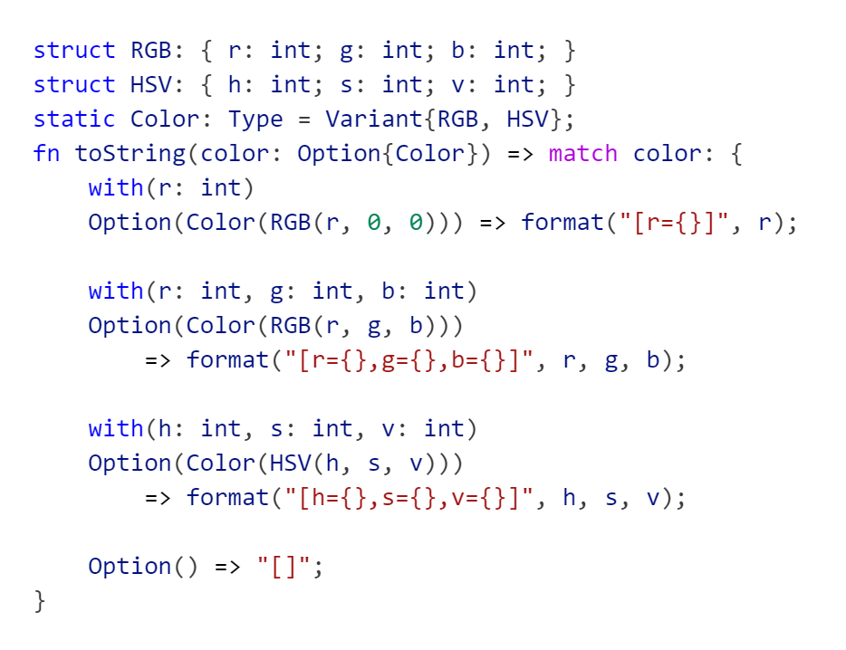
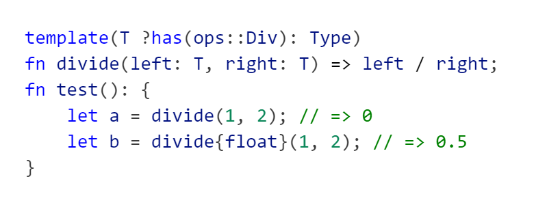
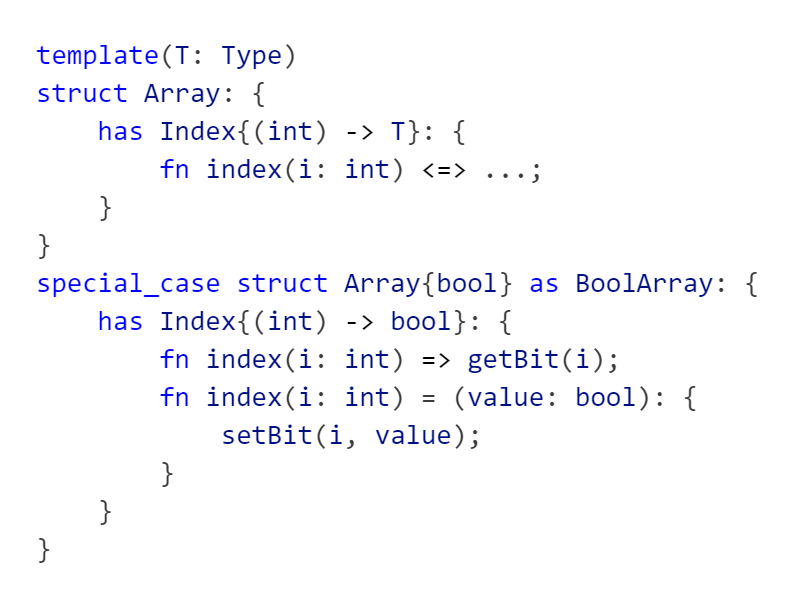
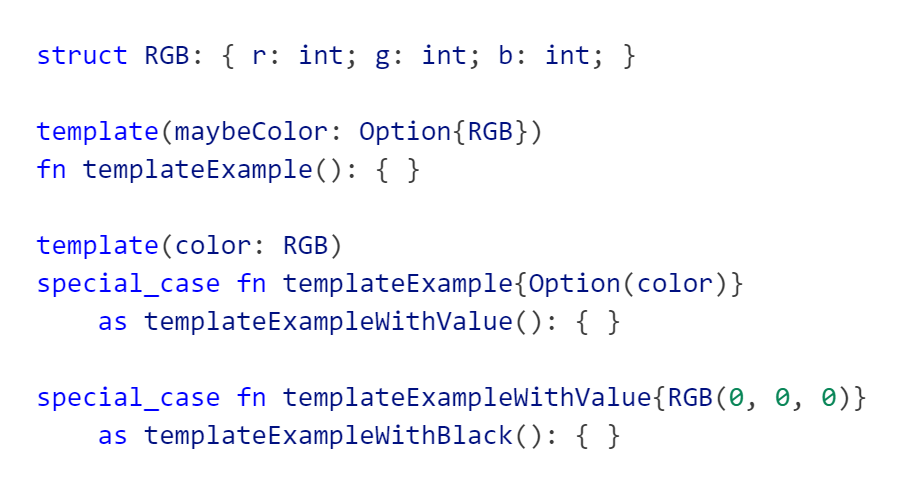
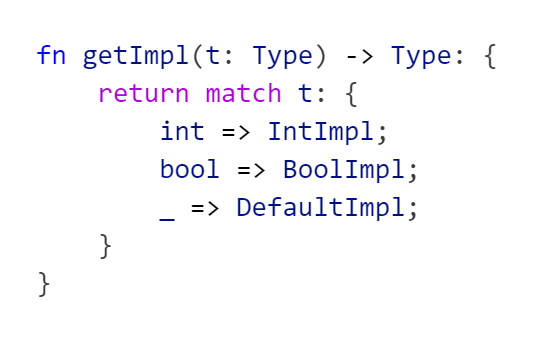

# Charge Language

## Inheritance / Traits
Many models of inheritance exist in different programming languages. Charge incorporates aspects of [C++ Classes](https://en.cppreference.com/w/cpp/language/derived_class), [LLVM-style RTTI](https://llvm.org/docs/HowToSetUpLLVMStyleRTTI.html), [Rust Traits](https://doc.rust-lang.org/book/ch10-02-traits.html) and [Rust Enums](https://doc.rust-lang.org/book/ch06-01-defining-an-enum.html) into its inheritance system.

Here is a basic example illustrating the syntax and usage:
 

### Traits
Traits are a powerful tool for writing generic code. The core idea is to define interface or trait that describes some common functionality shared by different types. Generic code can then use the interface to handle all types that implement it at once. In Charge interfaces are defined using `incomplete` types, which cannot be instantiated themselves and are allowed to have functions without a definition. The complete type that derives from the trait then has to implement these functions.
 

To get the full flexibility it must be possible to define common functionality among types not controlled by the trait author. Thus, a Trait may be implemented outside the type definition as long as it is empty, that is it has no fields.

Here is an example how to write generic code using Traits, for more details see [Template System](#template-system):
 

### Runtime Type Information
The RTTI in Charge aims to be lightweight and versatile and is mostly based on LLVM while being significantly less manual and expanding the functionality. Every type that implements a `virtual` function must either directly or indirectly derive from `ClassRoot` which introduces the necessary discriminator field into the type. This discriminator also allows querying dynamic information, like ["is-a"](https://en.wikipedia.org/wiki/Is-a) about the value:
 

It is also possible to create closed hierarchies using the `final` keyword. In Charge a `final` type can only be derived from in the definition of the type itself and a type marked `final(module)` can only be derived in the same source file as the definition. For such types [`match`](#matching--destructuring) expressions do not require a default case if all subclasses are covered by the other cases and the `Union` template can be used to construct a union type of all subclasses:
 

## Matching / Destructuring
In Charge the variables inferred by the match must be declared separately using a `with`-clause. This is done to avoid ambiguities that arise if such a variable has the same as an already existing one.
 

## Template system
The template definitions are check in isolation and before being instantiated. As a consequence the template parameters must be constrained using the `?` syntax and only the functionalities known to be there based on the constraints may be used. The template arguments can be either deduced or specified explicitly using `{}` braces. This is unlike `<>` syntax not ambiguous with the comparison operators.
 

Templates can also be specialized by using the `special_case` keyword to add special behavior for some arguments:
 

Naming the specialization using `as` is optional unless the case is to be further specialized. In that case the subsequent specialization have to name "parent" specialization instead of the original type, which gives the specialization the necessary partial order that would otherwise have to inferred by the compiler.
 

As suggested by the template parameter syntax types are just values of type `Type` and can be used like any other value:
 